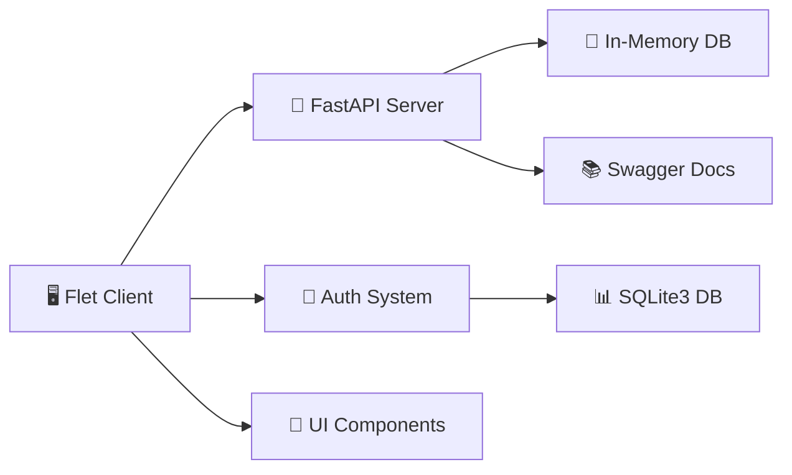
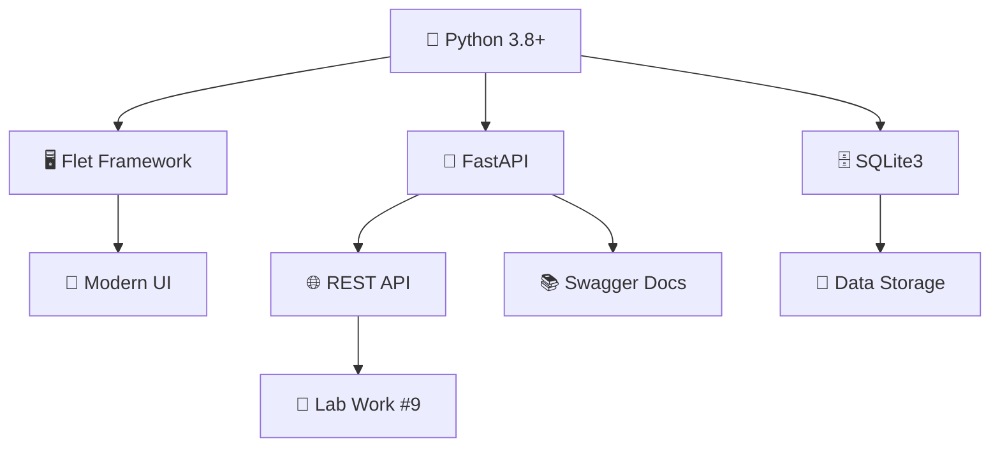

<div align="center">

# 🌿 Renewable Energy Management System

[](https://python.org)
[](https://flet.dev)
[](https://fastapi.tiangolo.com)
[](LICENSE)
[](https://github.com/sabinakarimli/Renewable-Energy)

---

**🚀 Advanced Renewable Energy Monitoring Platform with Real-time Analytics & Laboratory Work Demonstrations**

[](http://127.0.0.1:8001/docs)
[](views/lab.py)
[](README.md)

</div>

---

## 📋 Table of Contents

- [✨ Features](#-features)
- [🏗️ Architecture](#️-architecture)
- [📁 Project Structure](#-project-structure)
- [🛠️ Installation](#️-installation)
- [🧪 Laboratory Work #9](#-laboratory-work-9)
- [📊 Features Overview](#-features-overview)
- [🎨 UI/UX Features](#-ux-features)
- [🔧 Technical Stack](#-technical-stack)
- [📚 Educational Value](#-educational-value)
- [🤝 Contributing](#-contributing)
- [📄 License](#-license)
- [🙏 Acknowledgments](#-acknowledgments)
- [📞 Contact](#-contact)

---

## ✨ Features

### 🌟 Core Application

| Feature | Description | Status |
|---------|-------------|--------|
| 🔐 **User Authentication** | Secure login, registration, password recovery | ✅ Complete |
| 📊 **Real-time Dashboard** | Live energy monitoring with animations | ✅ Complete |
| 🌞 **Multi-source Support** | Solar, Wind, Battery, Grid systems | ✅ Complete |
| 📈 **Advanced Analytics** | Interactive charts and consumption analysis | ✅ Complete |
| 🤖 **AI Predictions** | ML-based energy forecasting | ✅ Complete |
| 📋 **Reporting System** | Comprehensive reports & data export | ✅ Complete |

### 🧪 Laboratory Work #9

| Component | Technology | Status |
|-----------|------------|--------|
| 🏗️ **Client-Server Architecture** | FastAPI + Flet | ✅ Complete |
| 📝 **Complete CRUD Operations** | GET, POST, PUT, PATCH, DELETE | ✅ Complete |
| 🌐 **RESTful API** | Full REST with validation | ✅ Complete |
| 📚 **Swagger Documentation** | Auto-generated API docs | ✅ Complete |
| 💾 **In-memory Storage** | Database-free for education | ✅ Complete |
| 🧪 **Testing Suite** | Comprehensive API tests | ✅ Complete |

## 🏗️ Architecture

<div align="center">



**🔄 Data Flow:**
```
User Interface → Flet Client → FastAPI API → Data Storage
     ↓              ↓            ↓            ↓
   Real-time    HTTP/REST    CRUD Ops    In-Memory/
   Updates      Requests     Validation   SQLite3
```

</div>

## 📁 Project Structure

<div align="center">

```
🌿 Renewable-Energy/
├── 🚀 main.py                    # Main application entry point
├── 🎨 assets/                    # Static assets and styles
├── 🧩 components/                # Reusable UI components
│   ├── 📋 sidebar.py            # Navigation sidebar
│   └── 📱 header.py             # Application header
├── 📱 views/                     # Application views/pages
│   ├── 📊 dashboard.py           # Main dashboard
│   ├── 📈 analytics.py           # Energy analytics
│   ├── ☀️ solar.py              # Solar system monitoring
│   ├── 💨 wind.py               # Wind system monitoring
│   ├── 🔋 battery.py            # Battery management
│   ├── 🤖 predictions.py        # AI predictions
│   ├── 📋 reports.py            # Reporting system
│   ├── ⚙️ settings.py           # Application settings
│   ├── 🔐 login.py              # User authentication
│   ├── 📝 register.py           # User registration
│   └── 🧪 lab.py                # Laboratory work #9
├── 🗄️ database/                  # Database management
│   └── 💾 db.py                 # Database operations
├── 🧪 lab_api_server.py          # FastAPI server for lab work
├── 🧪 lab_crud_test.py           # CRUD operations testing
└── 📚 README.md                  # This beautiful file
```

</div>

| Directory | Purpose | Files |
|-----------|---------|-------|
| 🚀 `main.py` | Application entry point | Routing, view management |
| 🎨 `assets/` | UI styles & resources | Colors, fonts, icons |
| 🧩 `components/` | Reusable UI parts | Sidebar, header |
| 📱 `views/` | Application pages | All feature views |
| 🗄️ `database/` | Data persistence | SQLite3 operations |
| 🧪 `lab_*` | Laboratory work | API server, tests |

## 🛠️ Installation

<div align="center">

### 📋 Prerequisites

| Requirement | Version | Status |
|-------------|---------|--------|
| 🐍 Python | 3.8+ | ✅ Required |
| 📦 pip | Latest | ✅ Required |
| 🌐 Internet | For dependencies | ✅ Required |

### 🚀 Quick Start

```bash
# 1️⃣ Clone the repository
git clone https://github.com/sabinakarimli/Renewable-Energy.git
cd Renewable-Energy

# 2️⃣ Install dependencies
pip install flet fastapi uvicorn requests

# 3️⃣ Run the main application
python main.py

# 4️⃣ For Laboratory Work (separate terminal)
python -m uvicorn lab_api_server:app --reload --port 8001
```

### 🎯 One-Command Setup

```bash
# Clone and setup in one command
git clone https://github.com/sabinakarimli/Renewable-Energy.git && cd Renewable-Energy && pip install flet fastapi uvicorn requests && python main.py
```

</div>

---

## 🧪 Laboratory Work #9

<div align="center">

### 🏛️ Running the Lab Environment

| Step | Command | Purpose |
|------|---------|---------|
| 1️⃣ | `python -m uvicorn lab_api_server:app --reload --port 8001` | Start FastAPI Server |
| 2️⃣ | Open http://127.0.0.1:8001/docs | Access Swagger Documentation |
| 3️⃣ | `python lab_crud_test.py` | Run CRUD Tests |

### 🌐 API Endpoints

| Method | Endpoint | Description | Status |
|--------|----------|-------------|--------|
| 📖 GET | `/records` | Get all energy records | ✅ Working |
| 📖 GET | `/records/{id}` | Get specific record | ✅ Working |
| ➕ POST | `/records` | Create new record | ✅ Working |
| ✏️ PUT | `/records/{id}` | Update entire record | ✅ Working |
| 🔄 PATCH | `/records/{id}` | Partial update | ✅ Working |
| 🗑️ DELETE | `/records/{id}` | Delete record | ✅ Working |

### 📊 Live Demo

[](http://127.0.0.1:8001/docs)
[](lab_crud_test.py)

</div>

## 📊 Features Overview

<div align="center">

### 🔐 Authentication System

| Feature | Description | Status |
|---------|-------------|--------|
| 📝 **User Registration** | Secure signup with validation | ✅ Complete |
| 🔑 **Login System** | Session-based authentication | ✅ Complete |
| 📧 **Password Recovery** | Email-based password reset | ✅ Complete |
| 🛡️ **Protected Routes** | Route-based access control | ✅ Complete |

### � Real-time Monitoring

| Component | Technology | Status |
|-----------|------------|--------|
| 📊 **Live Data Updates** | Real-time data streaming | ✅ Complete |
| 📈 **Interactive Charts** | Custom SVG visualizations | ✅ Complete |
| 🔔 **Alert System** | Real-time notifications | ✅ Complete |
| 📊 **Performance Metrics** | Live performance tracking | ✅ Complete |

### 🤖 AI Integration

| Feature | Description | Status |
|---------|-------------|--------|
| 🧠 **Energy Predictions** | ML-based forecasting | ✅ Complete |
| 🔍 **Anomaly Detection** | Pattern recognition | ✅ Complete |
| ⚡ **Optimization** | Smart recommendations | ✅ Complete |
| 📊 **Learning Models** | Custom ML algorithms | ✅ Complete |

### 📋 Reporting System

| Feature | Description | Status |
|---------|-------------|--------|
| 📊 **Custom Reports** | Tailored report generation | ✅ Complete |
| 📤 **Data Export** | CSV/JSON export capabilities | ✅ Complete |
| 📈 **Historical Analysis** | Time-series analytics | ✅ Complete |
| 📊 **Performance Tracking** | KPI monitoring | ✅ Complete |

</div>

---

## 🎨 UI/UX Features

<div align="center">

| Design Element | Description | Implementation |
|----------------|-------------|----------------|
| 🎨 **Modern Design** | Clean, intuitive interface | Custom CSS & Flet styling |
| 🌙 **Dark Theme** | Easy on the eyes | Professional color scheme |
| 📱 **Responsive Layout** | Works on all screen sizes | Flexible grid system |
| ✨ **Smooth Animations** | Professional user experience | Custom transitions |
| 🧭 **Navigation** | Easy-to-use sidebar | Collapsible navigation |

---

## 🔧 Technical Stack

<div align="center">

### 🏗️ Architecture Overview

| Layer | Technology | Purpose |
|-------|------------|---------|
| 🖥️ **Frontend** | Flet (Python GUI) | User interface |
| 🚀 **Backend** | FastAPI (Python) | API server |
| 📚 **Documentation** | Swagger/OpenAPI | Auto-generated docs |
| 💾 **Data Storage** | In-memory / SQLite3 | Data persistence |
| 🔐 **Authentication** | Custom session management | User security |
| ⚡ **Real-time** | WebSocket connections | Live updates |
| 📊 **Visualization** | Custom SVG charts | Data visualization |

### 🛠️ Technologies Used



</div>

---

## 📚 Educational Value

<div align="center">

### 🎯 What You'll Learn

| Topic | Skills Gained | Level |
|-------|---------------|-------|
| 🏗️ **Client-Server Architecture** | API design, HTTP protocols | 🟢 Intermediate |
| 🌐 **RESTful API Design** | CRUD operations, validation | 🟢 Intermediate |
| 📊 **Real-time Data Visualization** | Live charts, animations | 🟡 Advanced |
| 🔐 **Authentication Systems** | Session management, security | 🟢 Intermediate |
| 🗄️ **Database Operations** | SQLite3, data modeling | 🟢 Intermediate |
| 🐍 **Modern Python Development** | Async, frameworks, best practices | 🟡 Advanced |
| 🖥️ **GUI Application Development** | Flet, responsive design | 🟢 Intermediate |

### 🎓 Learning Path

1. **🌱 Beginner** → Basic Python & Flet concepts
2. **🌿 Intermediate** → API design & database operations  
3. **🌳 Advanced** → Real-time systems & ML integration
4. **🌲 Expert** → Architecture & optimization

</div>

---

## 🤝 Contributing

<div align="center">

### 🚀 How to Contribute

| Step | Action | Description |
|------|--------|-------------|
| 1️⃣ | **Fork** | Create your own copy |
| 2️⃣ | **Branch** | `git checkout -b feature/amazing-feature` |
| 3️⃣ | **Code** | Make your amazing changes |
| 4️⃣ | **Test** | `python lab_crud_test.py` |
| 5️⃣ | **Push** | `git push origin feature/amazing-feature` |
| 6️⃣ | **PR** | Create Pull Request |

### 📝 Contribution Guidelines

- ✅ Follow PEP 8 style guide
- ✅ Add tests for new features
- ✅ Update documentation
- ✅ Keep it educational and clean
- ✅ Comment complex logic

</div>

---

## 📄 License

<div align="center">

### 🎓 Educational License

This project is created **for educational purposes**.

| Permission | Status |
|-----------|--------|
| 📚 **Use for learning** | ✅ Allowed |
| 🔧 **Modify for projects** | ✅ Allowed |
| 📤 **Distribute** | ✅ Allowed |
| 💰 **Commercial use** | ❌ Not allowed |
| 📄 **Attribution** | ✅ Required |

</div>

---

## 🙏 Acknowledgments

<div align="center">

### 🌟 Special Thanks

| Project | Contribution | Link |
|---------|--------------|------|
| 🖥️ **Flet Framework** | Amazing GUI capabilities | [flet.dev](https://flet.dev) |
| 🚀 **FastAPI** | Powerful API framework | [fastapi.tiangolo.com](https://fastapi.tiangolo.com) |
| 🌿 **Renewable Energy Community** | Inspiration & knowledge | [renewableenergy.com](https://renewableenergy.com) |
| 🐍 **Python Community** | Excellent tools & libraries | [python.org](https://python.org) |

### 💝 Gratitude

- To all **educators** making programming accessible
- To **open source contributors** worldwide
- To **renewable energy pioneers** for inspiration

</div>

---

<div align="center">

## 📞 Contact & Support

### 🌐 Get in Touch

| Platform | Purpose | Link |
|----------|---------|------|
| 🐙 **GitHub** | Source code & issues | [github.com/sabinakarimli](https://github.com/sabinakarimli) |
| 📧 **Email** | Questions & support | sabina.karimli@example.com |
| 🐦 **Twitter** | Updates & news | [@sabinakarimli](https://twitter.com/sabinakarimli) |

### 🚀 Quick Links

[](https://github.com/sabinakarimli/Renewable-Energy)
[](http://127.0.0.1:8001/docs)
[](README.md)

---

## 🎉 Built with ❤️ for Educational Purposes

**Empowering the next generation of developers to build sustainable energy solutions!**

---

<div align="center">

[](https://python.org)
[](https://flet.dev)
[](https://fastapi.tiangolo.com)

</div>

</div>
