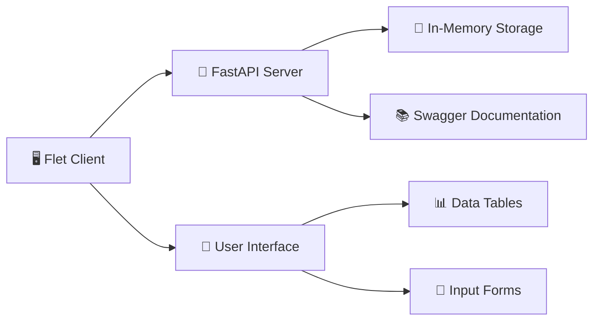

<div align="center">

# 🔬 Laboratory Work #9 - Client-Server Architecture

[](https://python.org)
[](https://fastapi.tiangolo.com)
[](https://flet.dev)
[](README.md)

---

**🚀 Complete Client-Server System with CRUD Operations & RESTful API**

</div>

---

## 📋 Overview

This laboratory work demonstrates a complete client-server architecture using FastAPI backend and Flet frontend, implementing full CRUD operations for renewable energy data management.

### 🎯 Learning Objectives

- ✅ Client-server architecture understanding
- ✅ RESTful API design and implementation
- ✅ CRUD operations (Create, Read, Update, Delete)
- ✅ Real-time data synchronization
- ✅ API documentation with Swagger
- ✅ Error handling and validation

---

## 🏗️ Architecture

<div align="center">



**Data Flow:**
```
User Interface → Flet Client → HTTP/REST API → FastAPI Server → In-Memory Storage
```

</div>

---

## 📁 Folder Structure

```
🔬 laboratory_work/
├── 📚 README.md                    # This documentation
├── 🚀 server/                     # FastAPI backend
│   └── fastapi_server.py          # Main API server
├── 🖥️ client/                     # Flet frontend
│   └── flet_client.py             # Client application
├── 🧪 tests/                      # Test suite
│   └── crud_api_tests.py          # CRUD operations tests
├── 📜 docs/                       # Documentation
└── 🎬 scripts/                    # Utility scripts
    └── start_lab_system.py        # Startup script
```

---

## 🚀 Quick Start

### Method 1: One-Command Startup (Recommended)

```bash
python laboratory_work/scripts/start_lab_system.py
```

### Method 2: Manual Startup

**Terminal 1 - Start Server:**
```bash
python -m uvicorn laboratory_work.server.fastapi_server:app --reload --port 8001
```

**Terminal 2 - Start Client:**
```bash
python laboratory_work/client/flet_client.py
```

### Method 3: Run Tests

```bash
python laboratory_work/tests/crud_api_tests.py
```

---

## 🌐 API Endpoints

| Method | Endpoint | Description | Status |
|--------|----------|-------------|--------|
| 📖 GET | `/records` | Get all energy records | ✅ Working |
| 📖 GET | `/records/{id}` | Get specific record | ✅ Working |
| ➕ POST | `/records` | Create new record | ✅ Working |
| ✏️ PUT | `/records/{id}` | Update entire record | ✅ Working |
| 🔄 PATCH | `/records/{id}` | Partial update | ✅ Working |
| 🗑️ DELETE | `/records/{id}` | Delete record | ✅ Working |
| 📊 GET | `/` | Health check | ✅ Working |
| 🎲 POST | `/init-sample-data` | Load sample data | ✅ Working |

---

## 📚 Swagger Documentation

<div align="center">

### 🌐 Access Interactive API Docs

**URL:** http://127.0.0.1:8001/docs

**Features:**
- 📖 Interactive API exploration
- 🧪 Test endpoints directly
- 📝 Request/response schemas
- 🔍 Parameter documentation

[](http://127.0.0.1:8001/docs)

</div>

---

## 🧪 Testing

### Run Complete Test Suite

```bash
python laboratory_work/tests/crud_api_tests.py
```

### Test Coverage

| Test Type | Description | Status |
|-----------|-------------|--------|
| 🔗 **Connection Test** | Server connectivity | ✅ Passed |
| 📖 **GET Tests** | Data retrieval | ✅ Passed |
| ➕ **POST Tests** | Record creation | ✅ Passed |
| ✏️ **PUT Tests** | Full updates | ✅ Passed |
| 🔄 **PATCH Tests** | Partial updates | ✅ Passed |
| 🗑️ **DELETE Tests** | Record deletion | ✅ Passed |
| 📚 **Swagger Tests** | Documentation access | ✅ Passed |

---

## 🎯 Features

### 🔧 Server Features

- ✅ **FastAPI Framework** - Modern, fast web framework
- ✅ **In-Memory Storage** - Database-free for education
- ✅ **Pydantic Validation** - Automatic data validation
- ✅ **Auto Documentation** - Swagger/OpenAPI integration
- ✅ **Error Handling** - Comprehensive error management
- ✅ **CORS Support** - Cross-origin resource sharing

### 🖥️ Client Features

- ✅ **Flet Framework** - Modern Python GUI
- ✅ **Navigation System** - Tab-based interface
- ✅ **Real-time Updates** - Live data synchronization
- ✅ **Form Validation** - Input validation and error handling
- ✅ **Data Tables** - Interactive data display
- ✅ **User Feedback** - SnackBar notifications

---

## 📊 Data Model

### EnergyRecord Schema

```python
class EnergyRecord(BaseModel):
    id: str              # Unique identifier
    source_type: str      # Solar, Wind, Battery
    power_output: float  # Power in kW
    efficiency: float    # Efficiency percentage
    status: str         # active, maintenance, etc.
```

### Sample Data

```json
{
    "id": "solar_001",
    "source_type": "Solar",
    "power_output": 5.2,
    "efficiency": 92.5,
    "status": "active"
}
```

---

## 🎨 User Interface

<div align="center">

### 📱 Client Application Features

| Feature | Description | Implementation |
|---------|-------------|----------------|
| 📋 **Records View** | Display all energy records | DataTable with pagination |
| ➕ **Add New Form** | Create new energy records | Form with validation |
| 🔄 **Real-time Sync** | Live data updates | HTTP requests |
| 🎨 **Modern UI** | Professional interface | Flet components |
| 📱 **Responsive** | Works on all screen sizes | Adaptive layout |

</div>

---

## 🔧 Technical Details

### 🛠️ Technologies Used

| Layer | Technology | Purpose |
|-------|------------|---------|
| 🖥️ **Frontend** | Flet | Python GUI framework |
| 🚀 **Backend** | FastAPI | Python web framework |
| 📚 **Documentation** | Swagger/OpenAPI | Auto-generated docs |
| 💾 **Storage** | In-memory Python dict | Educational simplicity |
| 🌐 **Protocol** | HTTP/REST | Client-server communication |
| 🧪 **Testing** | Requests library | API testing |

### 📋 Requirements

```txt
fastapi>=0.100.0
flet>=0.21.0
uvicorn>=0.23.0
requests>=2.31.0
pydantic>=2.0.0
```

---

## 🎓 Educational Value

### 🎯 What You'll Learn

1. **🏗️ Client-Server Architecture**
   - Separation of concerns
   - API design principles
   - Data flow management

2. **🌐 RESTful API Development**
   - HTTP methods and status codes
   - Resource-oriented design
   - API documentation

3. **📊 Data Management**
   - CRUD operations
   - Data validation
   - Error handling

4. **🖥️ GUI Development**
   - Event-driven programming
   - Form validation
   - Real-time updates

5. **🧪 Testing Methodology**
   - API testing
   - Integration testing
   - Test automation

---

## 🚀 Advanced Topics

### 🔍 Error Handling

```python
# Server-side error handling
try:
    # API operation
except ValueError as e:
    return {"error": f"Invalid data: {e}"}
except Exception as e:
    return {"error": f"Server error: {e}"}
```

### 📝 Data Validation

```python
# Pydantic model validation
class EnergyRecord(BaseModel):
    id: str
    source_type: str = Field(regex="^(Solar|Wind|Battery)$")
    power_output: float = Field(gt=0, lt=1000)
    efficiency: float = Field(ge=0, le=100)
```

### 🔄 Real-time Updates

```python
# Client-side real-time updates
def load_table():
    response = requests.get(f"{API_URL}/records")
    # Update UI with new data
    table.rows.clear()
    for item in response.json():
        # Add row to table
```

---

## 🤝 Contributing

### 📝 Adding New Features

1. **Server-side:** Add new endpoints in `server/fastapi_server.py`
2. **Client-side:** Update UI in `client/flet_client.py`
3. **Testing:** Add tests in `tests/crud_api_tests.py`
4. **Documentation:** Update this README

### 🧪 Development Workflow

```bash
# 1. Make changes
# 2. Test locally
python laboratory_work/tests/crud_api_tests.py

# 3. Update documentation
# 4. Commit changes
git add .
git commit -m "feat: add new feature"
```

---

## 📞 Support

### 🐛 Troubleshooting

| Issue | Solution |
|-------|----------|
| **Server not starting** | Check port 8001 availability |
| **Client can't connect** | Verify server is running |
| **Tests failing** | Check API endpoints status |
| **Data not updating** | Refresh client application |

### 📚 Additional Resources

- [FastAPI Documentation](https://fastapi.tiangolo.com)
- [Flet Documentation](https://flet.dev/docs)
- [REST API Design Guide](https://restfulapi.net)

---

<div align="center">

## 🎉 Laboratory Work Complete!

**🏆 Successfully implemented client-server architecture with full CRUD operations**

[](README.md)
[](README.md)

---

**Built with ❤️ for Educational Purposes**

[](https://python.org)
[](https://fastapi.tiangolo.com)
[](https://flet.dev)

</div>
